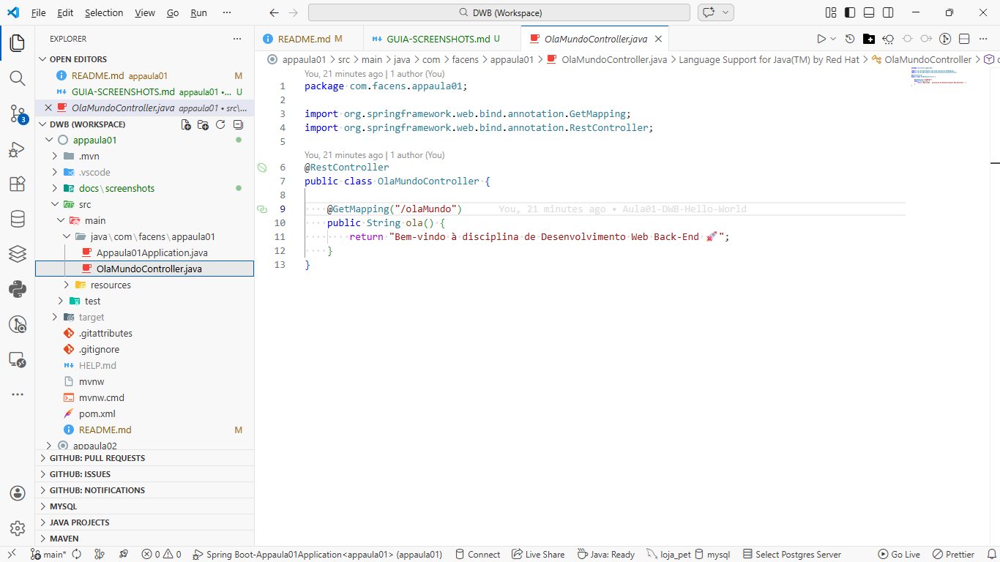
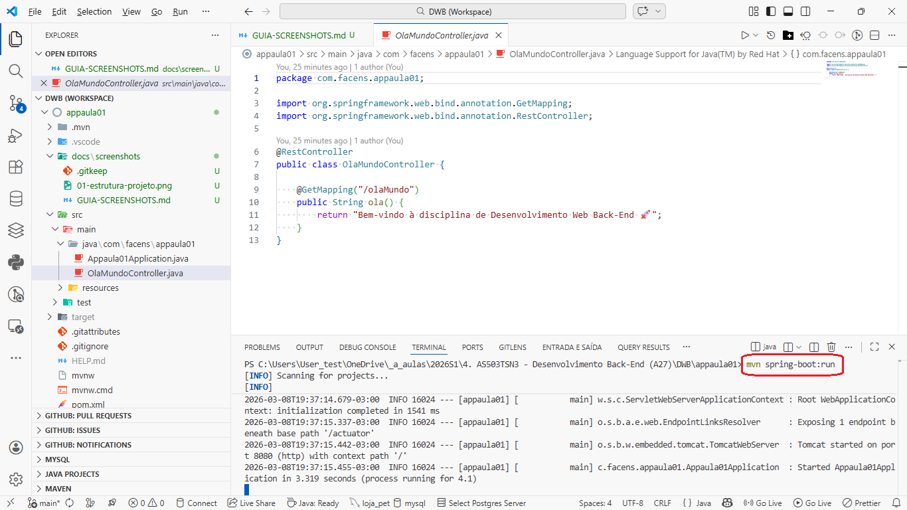
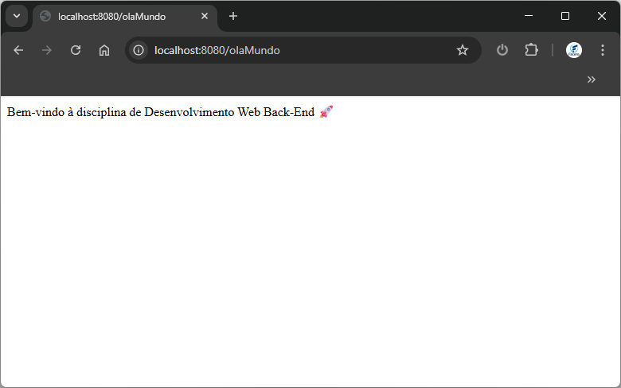

# AppAula01 - Spring Boot (Back-End)

[](https://www.oracle.com/java/technologies/javase/jdk17-archive-downloads.html)
[](https://spring.io/projects/spring-boot)
[](https://maven.apache.org/)
[](#)
[](#-licença)

Projeto introdutório de **Desenvolvimento Web Back-End** com **Java + Spring Boot**, criado para demonstrar uma API REST simples no VS Code.

---

## 📚 Sumário

- [📌 Sobre o projeto](#-sobre-o-projeto)
- [✨ Destaques](#-destaques)
- [🧰 Tecnologias utilizadas](#-tecnologias-utilizadas)
- [🗂️ Estrutura do projeto](#-estrutura-do-projeto)
- [✅ Pré-requisitos](#-pré-requisitos)
- [🚀 Passo a passo no VS Code](#-passo-a-passo-no-vs-code)
- [🖼️ Screenshots](#-screenshots)
- [🧪 Executar testes](#-executar-testes)
- [🔍 Endpoints úteis](#-endpoints-úteis)
- [📚 Observações](#-observações)
- [👨‍🏫 Contexto acadêmico](#-contexto-acadêmico)
- [📄 Licença](#-licença)

---

## 📌 Sobre o projeto

Este projeto expõe um endpoint HTTP GET:

- `GET /olaMundo`

Resposta esperada:

`Bem-vindo à disciplina de Desenvolvimento Web Back-End 🚀`

---

## ✨ Destaques

- API REST simples e ideal para início em Spring Boot.
- Setup rápido com **Maven Wrapper** (sem precisar instalar Maven globalmente).
- Guia completo para criar o projeto no VS Code passo a passo.

---

## 🧰 Tecnologias utilizadas

- **Java 17**
- **Spring Boot 3.5.11**
- **Maven (Wrapper: `mvnw`/`mvnw.cmd`)**
- **Spring Web**
- **Spring Boot Actuator**

---

## 🗂️ Estrutura do projeto

```text
.
├── pom.xml
├── mvnw
├── mvnw.cmd
├── src
│   ├── main
│   │   ├── java/com/facens/appaula01
│   │   │   ├── Appaula01Application.java
│   │   │   └── OlaMundoController.java
│   │   └── resources
│   │       └── application.properties
│   └── test/java/com/facens/appaula01
│       └── Appaula01ApplicationTests.java
└── README.md
```

---

## ✅ Pré-requisitos

Antes de começar, instale:

1. **VS Code**
2. **JDK 17** (Java 17)
3. Extensões do VS Code:
   - **Extension Pack for Java**
   - **Spring Boot Extension Pack** (opcional, mas recomendado)
4. **Git** (opcional, para versionamento)

> Dica: para confirmar a instalação do Java, abra o terminal e verifique se a versão é 17.

---

## 🚀 Passo a passo no VS Code

### 1) Criar o projeto Spring Boot

1. Abra o VS Code.
2. Pressione `Ctrl + Shift + P` para abrir a paleta de comandos.
3. Execute: **Spring Initializr: Create a Maven Project**.
4. Escolha as opções:
   - **Language**: Java
   - **Spring Boot**: `3.5.11` (ou a mais próxima disponível)
   - **Group Id**: `com.facens`
   - **Artifact Id**: `appaula01`
   - **Packaging**: Jar
   - **Java**: `17`
5. Em dependências, selecione:
   - **Spring Web**
   - **Spring Boot Actuator**
6. Escolha a pasta de destino e aguarde a geração.
7. Abra o projeto no VS Code.

### 2) Criar o Controller

Crie o arquivo:

`src/main/java/com/facens/appaula01/OlaMundoController.java`

Com este conteúdo:

```java
package com.facens.appaula01;

import org.springframework.web.bind.annotation.GetMapping;
import org.springframework.web.bind.annotation.RestController;

@RestController
public class OlaMundoController {

    @GetMapping("/olaMundo")
    public String ola() {
        return "Bem-vindo à disciplina de Desenvolvimento Web Back-End 🚀";
    }
}
```

### 3) Executar o projeto

No terminal do VS Code, na raiz do projeto:

#### Windows

```bash
.\mvnw.cmd spring-boot:run
```

#### Linux/macOS

```bash
./mvnw spring-boot:run
```

A aplicação deve subir em:

- `http://localhost:8080`

### 4) Testar o endpoint

Abra no navegador:

- `http://localhost:8080/olaMundo`

Você deve ver:

`Bem-vindo à disciplina de Desenvolvimento Web Back-End 🚀`

---

## 🖼️ Screenshots

> Sugestão: crie a pasta `docs/screenshots/` e adicione as imagens com os nomes abaixo.
>
> Guia de padronização: [`docs/screenshots/GUIA-SCREENSHOTS.md`](docs/screenshots/GUIA-SCREENSHOTS.md)

### VS Code com o projeto aberto



### Aplicação rodando no terminal



### Endpoint no navegador



---

## 🧪 Executar testes

Para rodar os testes automatizados:

#### Windows

```bash
.\mvnw.cmd test
```

#### Linux/macOS

```bash
./mvnw test
```

---

## 🔍 Endpoints úteis

- `GET /olaMundo`
- `GET /actuator/health`

Exemplos:

- `http://localhost:8080/olaMundo`
- `http://localhost:8080/actuator/health`

---

## 📚 Observações

- O projeto usa o **Maven Wrapper**, então não é obrigatório ter Maven instalado globalmente.
- Se a porta `8080` estiver ocupada, altere em `src/main/resources/application.properties`:

```properties
server.port=8081
```

---

## 👨‍🏫 Contexto acadêmico

Projeto base para a disciplina de **Desenvolvimento Web Back-End**.

Possíveis evoluções:

- novos endpoints (`POST`, `PUT`, `DELETE`)
- integração com banco de dados
- validações com Bean Validation
- arquitetura em camadas (Controller, Service, Repository)

---

## 📄 Licença

Uso educacional.